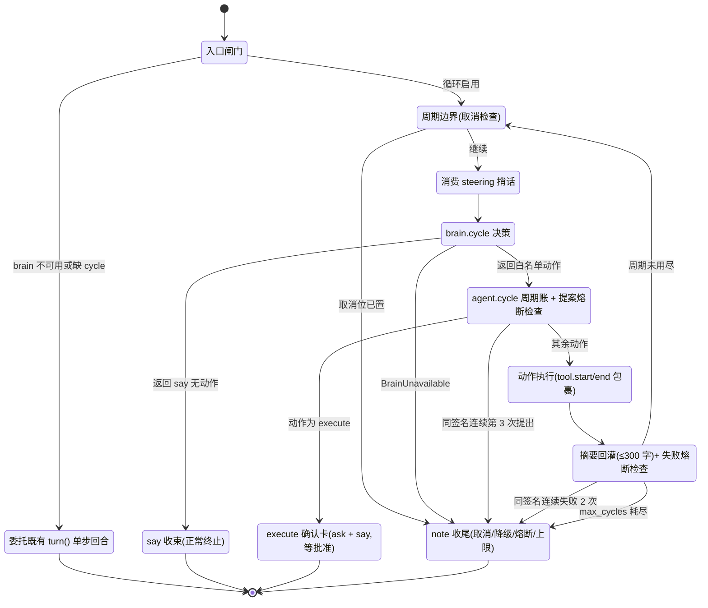

# InSAR-Agent 自主循环(converse loop)设计

> 2026-08-14 波次产出的正式设计文档。开发期互锁契约见 `docs/LOOP-CONTRACT.md`(保留为波次台账),
> 哲学修订依据见 `reference/PI_FRAMEWORK_ANALYSIS.md`(absorb-E 系列)与 `docs/DESIGN.md §8.3`、
> `docs/AGENT-DESIGN.md §3.3`(同波次已修订)。
> 本文行为描述与 `src/insar_agent/loop/driver.py` 的 `converse_loop` 实现逐条对照(2026-08-14 勘察);
> 因 11 个单元并行开发、行号仍在漂移,代码锚点一律用「文件 + 符号」而非行号。
> 集成验证由验证波次统一执行,各单元契约级测试见 §12;未实现能力如实列在 §13「后续路线」。

## 0. 阅读指引

| 你想知道 | 看哪节 |
|---|---|
| 为什么从「绝不串多步」转向自主循环 | §1 |
| 回合/周期/动作这些词什么意思 | §2 |
| LLM 每周期能做哪些动作 | §3 |
| 前后端靠什么事件互锁 | §4 |
| 循环怎么转、什么时候停 | §5 |
| 不可破的红线 | §6 |
| LLM 看到什么、绝不看到什么 | §7 |
| 与执行器/干预队列/取消怎么相处 | §8 |
| 联网检索与并行扇出 | §9 |
| 入口、开关、预算在哪里配 | §10 |
| 缺东西时退化成什么样 | §11 |
| 测试守着哪些行为 | §12 |
| 明确没做的事 | §13 |

## 1. 动机:从「绝不串多步」到「受约束的自主循环」

旧哲学(2026-08-12 及以前):LLM 只做候选集内选择题,**绝不串多步**——一次用户消息只换来一个
决策。依据是 BFCL v4 多轮评测里本地模型的低分(Qwen3-14B 端到端仅 41%,`DESIGN.md §8.2`)与
社区记录的「Ollama 7b-32B 第二个工具永不执行」。

这个依据在 2026-08-12 的 pi 框架对标(`reference/PI_FRAMEWORK_ANALYSIS.md`)后被重新审视:
BFCL 低分说明的是**不能让 LLM 自由规划多步**(开放式任意命令/任意工具序列),而不是
**不能让确定性代码替它串**。pi 的两层循环证明了:把「下一步做什么」的单个决策交给 LLM、
把「周期之间怎么衔接、什么时候必须停」交给确定性驱动器,循环的可靠性由驱动器而非模型保证。

于是哲学修订为(`DESIGN.md §8.3` 第 3 条、`AGENT-DESIGN.md §3.3` 约束一,同波次落实):

- **单周期单决策,回合可多周期**:每周期 LLM 仍只输出一个白名单动作或一句 say 收束,
  与旧纪律完全同构;多出来的只是确定性驱动器在周期之间的衔接。
- **约束内置,不靠模型自觉**:动作白名单闭集、周期上限、同签名熔断、审批门全部在驱动器里,
  LLM 输出越界动作会被丢弃(丢动作留 say),坏形状直接降级收束。
- **旧依据不作废**:BFCL 低分保留为「本地小模型默认关闭自主循环」的开关条件——
  循环开关在模型设置面板(§10),接本地 7B-32B 模型时建议关闭,回合退回单步问答。

没有变的东西:LLM 零命令零路径、brain 整层可拔除、执行必须经用户确认、日志不进上下文。
这些是 §6 的红线,自主循环在它们**之内**活动。

## 2. 术语与总体形状

| 术语 | 含义 |
|---|---|
| 回合(turn) | 一次用户消息到 Agent 收束的完整过程;单步回合走 `driver.turn`,自主回合走 `driver.converse_loop` |
| 周期(cycle) | 自主回合内的一次「LLM 决策 → 动作执行 → 摘要回灌」;n 从 1 递增,上限 max_cycles |
| 动作(action) | LLM 单周期的产出,取 §3 的白名单闭集;每周期至多一个 |
| say | 面向用户的话;「有 say 无 action」= LLM 主动收束,回合正常终止 |
| note | 非正常收尾事件:预算耗尽/取消/熔断/降级,一律如实说明原因 |
| 周期摘要 | 动作结果压缩成的 ≤300 字单行文本,是唯一回灌 LLM 的过程记忆 |

总体形状(伪代码级,真实实现见 `loop/driver.py` 的 `converse_loop`):

```
converse_loop(session, text, max_cycles=6):
    brain 不可用或缺 cycle 职责 → 整回合委托既有 turn(),逐事件转发,零回归
    for n in 1..max_cycles:
        1 取消检查(周期边界)          → 置位则 note 收尾
        2 消费 steering 捎话           → 并入回合目标,发 intervention 回执
        3 brain.cycle(goal, 周期摘要, 状态摘要)   → 经 asyncio.to_thread,不阻塞事件循环
          · BrainUnavailable → note 当场降级收束
          · 返回 say 无动作  → say 正常终止
        4 发 agent.cycle 周期账(每个动作周期恰一条,先于执行)
          · 同签名动作连续第 3 次提出 → 熔断,不执行,note 收尾
        5 动作执行(闭集分发,tool.start/tool.end 包裹)
          → 结果压缩为 ≤300 字摘要追加 cycles_summary
          → execute 动作:确认卡(ask)+ say 收束,terminal
        6 同签名动作连续失败 2 次未换策略 → note 收尾(unresolved_failure)
    自然耗尽 → note「已达周期上限」+ 进展摘要
```

## 3. 动作白名单闭集

闭集 10 项,与前端 `prototype/js/agentloop.js` 的 `ACTION_META` 一一对齐(该表已锁死,
增删动作必须两端同步):

| 动作 | 界面名 | 语义 | 副作用 |
|---|---|---|---|
| `search_data` | 搜索数据 | 本地盘点 + ASF 归档检索 + 可选网页检索,并行扇出(§9) | 只读,只发查询词 |
| `inspect_file` | 查看文件 | 查某步日志尾部/产物清单(step 字段)或按名匹配本地数据集(name 字段) | 只读,闭集匹配,绝不解引用路径 |
| `check_env` | 检查环境 | 环境摘要(引擎/磁盘/WSL) | 只读 |
| `list_data` | 列出数据 | 本地数据集清单 | 只读 |
| `status` | 查询状态 | 当前 run 的步骤状态摘要 | 只读 |
| `plan` | 制定计划 | 场景闭集校验后进入既有规划流程(`_plan_turn` 同源) | 建 run,停在待确认 |
| `execute` | 执行步骤 | **只产生确认卡(ask)+ say 收束**,绝不自启流水线 | 无(等用户批准) |
| `set_params` | 调整参数 | 参数校验后入干预队列(steer),消费点再校验 | 入队,不直接改 |
| `set_method` | 切换方法 | 方法闭集校验后入干预队列(steer) | 入队,不直接改 |
| `thinking` | 思考中 | 输出一段思考叙述(thinking 事件) | 无 |

越界动作不炸回合:brain 侧闭集校验先行拦截——丢动作留 say(附「动作越界已拦截」注记),
`done=True` 即安全收束,`source` 标 `"degraded"` 与干净收束区分(`facade.py` 的 `cycle`,
fail-closed)。驱动器分发前另有一道闭集复核(note「动作越界已忽略」+ 拒绝理由进摘要),
正常链路到不了那里——它只为打桩测试与防御纵深存在(brain 被替换或两端闭集漂移时兜底)。

## 4. 事件契约(前后端互锁)

| 事件 | 形状 | 说明 |
|---|---|---|
| `agent.cycle` | `{"t":"agent.cycle","n":i,"max":N,"action":"<动作>"}` | 每个动作周期恰一条,n 从 1 递增,先于动作执行;工厂 `loop/events.py` 的 `agent_cycle` |
| `tool.start` / `tool.end` | 既有形状(id 配对、exit、summary) | 周期内工具执行复用,id 取 `loop{n}` |
| `say` | 既有形状 | 正常终止;同时写入聊天历史 |
| `note` | 既有形状(tone=warn) | 预算耗尽/取消/熔断/降级收尾,原因如实写进文本 |
| `ask` | 既有形状 | execute 动作产生的执行确认卡 |
| `intervention` | 既有形状 | steering 捎话被并入目标时的回执 |

通路纪律:

- 所有事件经 driver 的 `_emit` 走**双通道**——NDJSON 回合流(`POST /api/converse` 响应)+
  SSE 事件总线(旁观标签页/前端模块自建订阅)。
- `app.js` 的 `consume()` 对 `agent.cycle` **静默丢弃**(未知事件容忍纪律);渲染由
  `agentloop.js` 自建 SSE 订阅完成——进度条「自主工作中 · 第 n/N 步 · 当前：动作」、
  停止按钮、回合结束后原位转「工作记录」折叠卡。该事件因此在
  `tests/test_e2e_contract.py` 事件注册表中按 BACKEND_ONLY 豁免登记。
- **say 收束的周期不发 agent.cycle**(决策为收束时直接 say,不再开新周期账);
  前端回合结束判定不依赖事件语义:本地回合以 busy 归零为准,旁观回合 say 立即收卡、
  note 后静默窗兜底(见 `agentloop.js` 头注的状态机说明)。

### 4.1 delta 例外条款:流式帧不上事件总线(0814B W2)

聊天回合(`driver.turn`)的流式回复引入两种**展示旁路帧**(工厂在 `loop/events.py`,
线程桥在 `loop/driver.py` 的 `_converse_stream`):

| 事件 | 形状 | 语义 |
|---|---|---|
| `say.delta` | `{"t":"say.delta","text":"<增量>"}` | 回复增量;生命周期 say.delta × N → 终帧二选一 |
| `say.abort` | `{"t":"say.abort","reason":"truncated"\|"unavailable"\|"stopped"}` | 流中止标废:半截回复不是回复 |

例外条款:**say.delta / say.abort 只走回合 NDJSON(driver 裸 yield),不经 `_emit`,
因此不上 EventBus(全局 SSE)、不进 trace**;终帧 `say`(定稿,parts 整体替换)照旧
`_emit` 双通道。这是「所有事件双通道」纪律(§4 通路纪律)唯一的成文例外。理由:

- **增量是半成品,不是事实**:总线消费者(trace 面板、旁观标签页、agentloop 工作
  记录卡)以「事件 = 已发生的事实」为约定;把逐 token 增量广播出去,旁观端要么重复
  实现拼装状态机,要么把半截文本当完整消息渲染。事实记录只有终帧:say 定稿,或
  say.abort 标废之后的降级 note。
- **量级不对称**:一条回复的 delta 帧数可达终帧的几十倍,广播到总线会挤占订阅队列
  (EventBus 满队按丢最旧处置),反而威胁真正的事实事件。
- **消费闭环在回合内**:发起回合的客户端是唯一需要打字机效果的消费者,回合 NDJSON
  正好是它专属的通道;断连即无消费者,增量丢弃无损(定稿仍落聊天历史,重连可回放)。

配套纪律:截断/失败的半截回复**不落聊天历史、不驱动动作**(`ConverseResult` 只在
成功时产生,失败路径 outcome 保持 None);`say.abort` 的 reason 闭集中,后端当前只发
truncated(token 上限截断)与 unavailable(供应商失败),stopped 预留给停止链路
(前端停止时在本地即时标废,不等服务端回帧);`converse_loop` 的周期决策
(`brain.cycle`)本波保持非流式,摘要回灌不受影响。守护测试:`tests/test_turn_stream.py`。

## 5. 循环状态机与终止条件闭集



终止条件是**闭集**,除 say/execute 外一律 note 收尾并如实说明:

| # | 终止条件 | 触发 | 收尾 |
|---|---|---|---|
| 1 | say 收束 | LLM 返回 say 且无动作(`CycleResult.done`) | `say`,写聊天历史,正常终止 |
| 2 | execute 确认卡 | LLM 提出 `execute` 且会话有 run | `ask` 确认卡 + `say` 收束,等用户批准 |
| 3 | 周期上限 | max_cycles 耗尽(默认 6,值域 1-12) | `note`,附 ≤200 字进展摘要 |
| 4 | 用户取消 | `/api/abort` 控制位 / 进度条停止按钮,周期边界检查 | `note`,已完成周期的结果保留 |
| 5 | LLM 不可用 | `BrainUnavailable`(供应商失败/坏形状) | `note`,当场降级收束 |
| 6 | 同签名提案熔断 | 同一动作(JSON 排序键签名)连续提出 3 次 | `note`,第 3 次不执行 |
| 7 | 未换策略熔断 | 同签名动作连续失败 2 次 | `note`,`unresolved_failure` 如实声明问题未解决 |

阈值常量:`loop/driver.py` 的 `_LOOP_REPEAT_BREAKER = 3`、`_LOOP_FAILURE_BREAKER = 2`,
沿用 `AGENT-DESIGN.md §3.3` 约束二的熔断谱系(cline 三段式的收紧版:循环场景直接硬熔断,
不设软警告档)。单周期动作失败**不是**终止条件——失败如实进摘要,留给 LLM 下周期换策略,
连续不换才熔断。

## 6. 红线清单(不可破)

1. **brain 可拔除**:`Brain(None)`/无路由/缺 `cycle` 职责时,`converse_loop` 整回合逐事件
   委托既有 `turn()`,单步行为逐字节不变;既有守护测试(`tests/test_converse.py` 降级组)
   必须原样通过。`turn()` 的行为与签名一个字节都不许变。
2. **审批不被循环绕过**:`execute` 动作只产生确认卡(ask)并收束回合,绝不自启流水线;
   「计划不会自动开始」的用户承诺(`docs/USER-GUIDE.md §1.6`)不因自主循环而变。
3. **LLM 零命令零路径**:动作是闭集;`inspect_file` 只接受步骤号/数据集名并做闭集匹配查表,
   LLM 给的值绝不当文件系统路径解引用;`set_params`/`set_method` 双重校验
   (brain 侧闭集校验 + 驱动器 registry 复核),消费点 `apply_change` 还会再校验一次。
4. **日志绝不进 LLM 上下文**:动作结果经 `loop/budget.py` 的 `clip_summary` 压成 ≤300 字
   单行摘要回灌,原始日志只落盘;`inspect_file` 的日志读取走有界尾部(4KB 截尾取末行)。
5. **联网只出查询词**:net 层只发送查询词与检索参数,不上传任何本地数据;凭据不进日志
   不进 LLM;UA 标识 insar-agent;单次响应体 2MB 上限,超限截断并标注(§9)。
6. **执行类动作永远走五阶段执行器与运行锁**:循环本身不启动重型计算;执行入口只有
   用户批准确认卡之后的既有流水线路径(§8)。
7. **每周期入事件账本**:`agent.cycle` 经 `_emit` 双通道发布,回合过程对用户与旁观者
   全程可见、可停止。

## 7. Brain 第五职责 cycle 与上下文纪律

`brain/facade.py` 新增第五职责(与 intent/select/triage/narrate 并列,`AGENT-DESIGN.md §3.5`):

```python
@dataclass
class CycleResult:
    action: dict | None   # {"type": <闭集>, ...} 或 None
    say: str | None       # 面向用户的话(收束语或过渡语)
    done: bool            # True = LLM 选择收束(有 say 无 action)
    source: str           # "llm" | "degraded"
    route_index: int | None = None   # 实际路由下标,驱动器取之作 route_pin 钉死路由

def cycle(self, *, goal, cycles_summary, state_summary, registry,
          route_pin: int | None = None) -> CycleResult
```

上下文组装纪律(红线 §6.4 的实现面):

- **不带对话历史**。messages 只有两条:system = 静态循环提示词(动作闭集 + 纪律,
  声明式,<2KB);user = 回合目标 + 系统状态摘要 + 逐周期结构化摘要(每条 ≤300 字)。
  这是 `AGENT-DESIGN.md §3.3` 约束四「决策请求不带对话历史」的循环版。
- **JSON 硬约束**:走 `provider.chat(json_only=True)`,payload 带
  `response_format={"type":"json_object"}` + `temperature=0`。
- **截断整体拒绝**(absorb-E9):`finish_reason == "length"` 时 provider 抛
  `BrainTruncated`——被截断的 JSON 即使能解析也可能语义不完整,一个都不执行。
- **动作校验**与聊天回合的 `converse` 动作共用同一套纪律(`_validate_converse_action`
  同款):越界动作丢动作留 say;缺 say 的坏形状抛 `BrainUnavailable`;`enabled` 闸门相同。
- **路由钉死**:首周期按单跳 fallback 语义选路,返回 `route_index`;驱动器把它作为
  `route_pin` 传给后续周期,钉死路由、失败不切换直接抛——防止周期间供应商漂移
  导致回合内行为不可比。
- **用量入账**:`provider.chat` 以 `kind="agent"` 上报用量,驱动器在回合外围用
  `usage_context(session_id)` 绑定会话,循环烧了多少 token 在用量账本里可查。

## 8. 与五阶段执行器、干预队列、取消的关系

**循环不执行,执行不循环。** 重型计算仍然只有一条路:用户在确认卡上批准 → 既有
`/api/pipeline` 回合 → 五阶段执行器(PREPARED→LAUNCHED→RUNNING→COLLECTED→VERIFIED,
`AGENT-DESIGN.md §4`)与运行锁。自主循环与执行层的全部接触点:

| 接触点 | 机制 |
|---|---|
| `execute` 动作 | 只发确认卡(ask)+ say 收束;会话无 run 时直接拒绝并提示先 plan |
| `plan` 动作 | 与聊天 plan 分支同源(`_plan_turn`):场景闭集校验、环境探测、`make_plan`、决策点叙述;run 停在 planning 时如实记为失败摘要 |
| `set_params` / `set_method` | 入 `pending_actions` 干预队列(`deliver_as='steer'`),消费点在执行回合的检查点,`apply_change` 再校验;循环内绝不直接改状态 |
| steering 捎话 | 用户在循环运行中发的 USER_MESSAGE(steer)在**周期边界**被消费,并入回合目标并发 intervention 回执(pi absorb-E4 的消费时机) |
| 取消 | 复用既有 `POST /api/abort` 控制位(E3:取消是 control 位不是状态),不新增端点;循环在周期边界响应,已完成周期的结果保留;会话无任何 run 时(converse 回合不产生 run)abort 不再 404——置会话级同进程取消 token,仍 202 |

取消的消费语义(与执行回合共存的关键):run 未在执行(status != running)时,循环是取消
意图的唯一在场消费者——兑现(note 收束)后复位控制位并释放 token,不让遗留意图误拦用户
下一次显式执行;run 正在执行时循环只读不碰,控制位归执行回合的入口/步间检查点。
无 run 的会话没有 control 位可落:`/api/abort` 置 driver 的会话级一次性 token(仍回 202),
循环同样在周期边界消费(消费即清除);显式 `run_id` 的 404 口径与有 run 会话的语义不变。

## 9. 子任务池与联网层

### 9.1 子任务池(`loop/subtasks.py`)

```python
@dataclass
class SubResult:
    name: str; ok: bool; value: object | None; error: str | None; elapsed_ms: int

async def gather_limited(named_tasks, *, limit=3, timeout=None) -> dict[str, SubResult]
```

- 并发上限走信号量;单个子任务异常/超时**不炸整批**,如实进 `SubResult.error`;
- 同步阻塞函数由调用方 `asyncio.to_thread` 包成协程再入池;
- **执行类(io=heavy)任务不进此池**——运行锁语义不变,池只服务只读检索/探测类任务;
- 实现另提供可选 `bus`/`tool_id` 进度上报(tool.log 形状,总线故障不影响结果)与
  `run_sync_limited` 便捷入口(同步函数内部 `to_thread` 包装),均为契约超集,不改上述语义。

### 9.2 联网层(`net/`,纯 stdlib urllib,零第三方依赖)

```python
asf_search(platform="SENTINEL-1", intersects_wkt=None, start=None, end=None, ...)
    # GET {INSAR_ASF_SEARCH_BASE}/services/search/param  output=jsonlite,匿名可用
web_search(query, k=5)   # 默认免密钥端点;设 INSAR_TAVILY_KEY 则优先 Tavily
search_fanout(...)       # {"asf": [...]|{"error":...}, "web": ...} 部分失败不整体失败
```

- 错误闭集 `NetError(kind="timeout"|"http"|"parse"|"offline")`,绝不裸抛 urllib 异常;
- base URL 可用环境变量覆盖(`INSAR_ASF_SEARCH_BASE` / `INSAR_WEBSEARCH_BASE` /
  `INSAR_TAVILY_BASE`),仅接受 http/https(越界按 `NetError(kind="http")` 拒绝),
  测试全程离线、指向本地 mock server(`tests/test_net_search.py`);
- 联网纪律见红线 §6.5:只发查询词、UA 标识、2MB 响应上限。

### 9.3 `search_data` 动作的扇出

驱动器对 net 与 subtasks 做**防御性惰性 import**(`_memory_snippets` 先例):模块缺失、
接口不符、扇出器抛错,一律优雅降级为「仅本地盘点」并在摘要里如实标注,检索能力缺位
绝不炸循环。扇出内容:本地数据集盘点 + ASF 检索(动作的 `region`/`timerange` 由驱动器
翻译为 `intersects_wkt`/`start`/`end`;region 非 WKT、timerange 解析不出时不上送对应
参数,摘要注记),LLM 给出 query 字段时追加网页检索;`gather_limited(limit=3,
timeout=25s)` 并行执行,任一来源成功即算本周期成功,逐源失败原因进摘要。**检索结果只进周期摘要供 LLM 参考,不写数据目录、
不进 provenance 证据链**——真正的数据获取仍走流水线第 1 步能力(可审计)。

## 10. 入口与配置面

| 面 | 内容 |
|---|---|
| API | `POST /api/converse`,body `{"session","text","max_cycles"}`;校验全部挡在开流前:session 校验同 `/api/turn`,`1 <= max_cycles <= 12` 越界 400(带候选说明);缺省从 llm.json 的 `agent_max_cycles` 取(损坏/越界自我复核回 6);响应 NDJSON 回合流 |
| 停止 | 复用 `POST /api/abort`(控制位),不新增端点;前端进度条「停止」按钮走同一链路 |
| 前端 | `app.js` 的 submit() 优先走 `runConverse`(`backend.sse.js`),旧后端 404/405 时当次回退 `runTurn` 并记忆,不重复探测;进度条/工作记录卡由 `agentloop.js` 渲染;离线 mock 剧本(`backend.mock.js` 与 `?agentloopmock=1`)保留演示通道 |
| 配置 | llm.json 两个可选键:`agent_loop`(默认 true)/`agent_max_cycles`(默认 6,值域 1-12);损坏/越界回默认绝不抛(`brain/llm_config.py` 的 `agent_loop_settings`);`GET/POST /api/llm/config` 回显与校验合并写入(密钥掩码规则不变) |
| 设置面板 | 顶栏「模型」面板内「自主循环(单回合内多周期自主推进)」开关 + 周期上限输入(`llmsettings.js`);面板明示:关闭后回合退化为单步问答,执行类操作永远只产生确认卡 |
| MCP | 新工具 `insar_converse(session_id, text, max_cycles=6)`:消费 NDJSON 到回合结束,返回 say/note 文本 + 周期账(n/action 列表);deadline 环境变量 `INSAR_MCP_CONVERSE_TIMEOUT`(默认 180s);旧后端无该端点时归一化 `BackendError` 带升级指引 |
| 本地小模型 | 开关条件(§1):接 7B-32B 本地模型时建议关闭自主循环,依据 BFCL 多轮低分;当前为手动开关,按路由自动判别在 §13 后续路线 |

## 11. 降级矩阵

| 缺位/故障 | 行为 | 落点 |
|---|---|---|
| brain 禁用 / 无路由 / 缺 `cycle` 职责 | 整回合委托既有 `turn()`,单步行为逐字节不变 | `converse_loop` 降级闸门 |
| `agent_loop=false`(设置面板关闭循环) | `/api/converse` 直接走既有 `turn()` 单步问答,零 `agent.cycle` 事件 | `app.py` 的 `agent_loop_enabled` 闸门 |
| 无 LLM 密钥 | 同上:回合退化为单步问答(规则路径),用户手册 §5.3 有对应说明 | `llm_config` / `Brain.enabled` |
| 回合中途 LLM 不可用 | `BrainUnavailable` → note 当场降级收束,已完成周期结果保留 | 终止闭集 #5 |
| LLM 响应被截断 | `BrainTruncated` 整体拒绝(含 tool_calls,absorb-E9),不执行任何「可解析」片段 | `provider.chat` |
| LLM 输出越界动作 | brain 侧拦截即安全收束:丢动作留 say,`done=True`,`source="degraded"`;驱动器闭集复核仅为打桩/防御路径,正常链路不触发 | `facade.cycle`(主)/ 驱动器分发(防御) |
| net / subtasks 模块缺失 | `search_data` 降级为仅本地盘点,摘要如实标注 | 防御性惰性 import |
| 检索扇出器异常 | 同上退回仅本地盘点;未消费协程显式关闭 | `_loop_search_data` |
| ASF / 网页单源失败 | 部分失败不整体失败,逐源 error 进摘要 | `search_fanout` / `SubResult` |
| `INSAR_TAVILY_KEY` 缺失 | `web_search` 走免密钥端点 | `net/websearch.py` |
| 旧后端无 `/api/converse` | 前端 404/405 当次回退 `runTurn` 并记忆;MCP 报 `BackendError` 带升级指引 | `app.js` / `mcp/backend.py` |
| llm.json 循环键损坏/越界 | 回默认(enabled=True, max_cycles=6),绝不抛 | `agent_loop_settings` |
| 前端 `agentloop.js` 加载失败 | 可视化层安全降级,回合照常(`consume()` 静默丢弃 agent.cycle) | `index.html` script 注释 |

## 12. 测试守护点

| 守护对象 | 测试 | 单元 |
|---|---|---|
| 终止条件闭集/熔断/取消/降级闸门/摘要预算 | `tests/test_agent_loop.py` | B1 |
| `turn()` 单步行为零回归(降级组原样通过) | `tests/test_converse.py`(既有) | 铁律 |
| `agent.cycle` 事件形状登记 | `tests/test_e2e_contract.py` 事件注册表 | B1 |
| `provider.chat`(截断整体拒绝/route_pin/用量 kind) | `tests/test_provider_chat.py` | B2 |
| `brain.cycle`(闭集校验/坏形状/enabled 闸门) | `tests/test_brain_cycle.py` | B3 |
| net 层(错误闭集/env 覆盖/离线 MockServer) | `tests/test_net_search.py` | B4 |
| `/api/converse` 协议(开流前 400/NDJSON 透传/abort/skills 挂载/llm.json 热替换) | `tests/test_api_loop.py` | B5 |
| 前端进度条状态机与事件契约 | `prototype/agentloop.check.mjs` + `scripts/check_frontend.py` | B6 |
| 前端 runConverse 回退与诚实徽章 | `tests/js/converse_fallback.test.mjs` | B6 |
| 子任务池(并发上限/单任务异常隔离/超时) | `tests/test_subtasks.py` | B8 |
| MCP `insar_converse`(打桩后端/超时/旧后端报错) | `tests/test_mcp_server.py` 增补 | B9 |
| 配置面(`agent_loop`/`agent_max_cycles` 值域与回显) | `tests/test_llm_agent_config.py` | B10 |
| 鲁棒性(预算越界/非法 JSON/并发回合/会话隔离/取消风暴/事件形状不变量) | `tests/test_api_loop_robustness.py` | B11 |

公共纪律:测试密封(monkeypatch `INSAR_HOME`/空 probe/断网)、时序敏感断言打
`@pytest.mark.timing` 并乘 `TIME_FACTOR`;本波各单元先按契约用 monkeypatch/假对象验证,
全量集成由验证波次统一跑。

## 13. 后续路线(2026-08-14 波次明确未做,不虚报)

- **流式 token 输出**:`provider.chat` 本波是非流式(整段返回);识图函数的 SSE 聚合逻辑
  已抽成模块级 `_iter_sse` 供复用,为后续 chat 流式留位。前端进度条按周期粒度渲染,
  不依赖 token 流。
- **真实子代理进程隔离**:子任务池是 asyncio 协程并发(`gather_limited`),不是进程隔离;
  pi 式「spawn 子进程 + 消费 JSONL 事件流」的子代理形态未做。
- **本地小模型自动判别关断**:`agent_loop` 开关是手动的;按路由/模型名自动关闭循环未做,
  当前靠设置面板与文档建议(§1、§10)。
- **跨回合循环记忆**:周期摘要只活在单个回合内,不落 provenance、不跨回合;回合之间的
  记忆仍走既有用户记忆机制(`brain/memory.py`)。
- **周期内多动作**:每周期严格单动作;`search_data` 的并行扇出是动作内部的只读子任务,
  不是多动作并行。
- **检索结果入数据资产**:ASF/网页检索命中只进周期摘要,不自动登记数据目录或触发下载;
  数据获取的可审计路径仍是流水线第 1 步。
