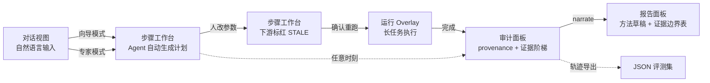

# insar-agent UI 设计方案（2026-08-10）

> 依据：16 个参考仓库界面研究 + DESIGN.md §5 分层架构。
> 参考来源：InSAR_Agent（三栏+stepper，已跑通验证）、k-dense-byok（Lab Notebook/多tab/引用徽章）、
> Planetary-Explorer（地图+聊天双面板）、SWMMCanada（地图+控制面板）、GeoAgent（确认钩子概念）。

---

## 1. 设计目标与原则

**用户是谁**：双模式——专家（手动指定每步方法）+ 向导（Agent 自动决策）；同时是教学演示工具（讲师身份）。

**四原则**：
1. **过程可视化 > 结果展示**：核心价值是"可复现"，UI 必须把 11 步流水线、失效传播、证据链**画出来**，而不是藏起来
2. **每一步都可点、可改、可解释**：专家模式点一步改方法 → 界面立刻显示哪些下游标红（stale 传播的视觉化）
3. **对话是入口，工作台是主战场**：自然语言发起，但真正的操作发生在步骤工作台
4. **证据永远可见**：任何产物都能点开"它由什么命令、什么参数、什么版本生成"——这是与所有竞品 UI 的根本区别

**教学演示属性**：stepper 四态动画（pending/running/completed/failed）+ stale 级联标红，天然适合课堂演示"参数改动如何使下游失效"。

---

## 2. 布局总览（三栏 + 顶栏）

```
┌────────────────────────────────────────────────────────────────────────────┐
│ 顶栏：项目名 | 模式切换[专家|向导] | 运行状态(心跳灯) | 会话tab | 用户      │
├──────────┬──────────────────────────────────────┬──────────────────────────┤
│ 左侧栏    │ 中间主区（视图切换）                   │ 右侧上下文面板           │
│ (240px)  │                                      │ (360px)                 │
│          │ ┌──────────────────────────────────┐ │ ┌──────────────────────┐ │
│ 项目列表   │ │ 视图A：对话视图                   │ │ │ 地图/影像（形变/干涉/  │ │
│  ▾ 项目   │ │  hero问候+提示chips              │ │ │ 时序）                 │ │
│   会话1   │ │  消息流（用户/Agent/工具/思考/    │ │ │ 图层切换+时间轴        │ │
│   会话2   │ │  错误 五种消息类型）              │ │ ├──────────────────────┤ │
│          │ │  底部输入框+工具条                │ │ │ 当前步骤详情：          │ │
│ 导航：     │ ├──────────────────────────────────┤ │ │  方法选择/参数表单/    │ │
│ ▸ 工作台   │ │ 视图B：步骤工作台                │ │ │  产物列表/指纹/证据    │ │
│ ▸ 审计     │ │  横向stepper(11步)             │ │ ├──────────────────────┤ │
│ ▸ 报告     │ │  每步卡片：方法/参数/状态/产物    │ │ │ 运行队列/长任务进度    │ │
│ ▸ 轨迹     │ │  失效标红级联                   │ │ └──────────────────────┘ │
│ ▸ 设置     │ └──────────────────────────────────┘                          │
└──────────┴──────────────────────────────────────┴──────────────────────────┘
```

**布局来源**：三栏结构直接继承 InSAR_Agent（已验证可用）；右侧上下文面板借鉴 Planetary-Explorer 地图+信息双区；顶栏模式切换是我们独有的（专家/向导）。

---

## 3. 九个核心组件

### 3.1 顶栏（全局状态）
| 元素 | 内容 | 来源 |
|---|---|---|
| 模式切换 | 专家/向导（高亮当前，切换即改变 planner 行为） | 独有 |
| 运行状态灯 | 绿=空闲/蓝=处理中/红=失败；双 SSE 心跳 | InSAR_Agent 双 SSE |
| 会话 Tab | 多会话并行（BYOK 的多 chat tab） | k-dense-byok |

### 3.2 对话视图（视图 A）
- hero 问候 + 提示 chips（"分析青海冻土形变"等场景示例）→ InSAR_Agent
- 消息流五种类型（已由 events.py 定义）：user / agent / **tool**（绿边）/ **thinking**（黄边斜体）/ **error**（红居中）
- 工具消息可内嵌表格/影像（MintPy 结果表、干涉图缩略）
- 底部输入框 + 工具条（附件/截图/清除上下文）→ InSAR_Agent tools-bar
- **关键增强**：Agent 每次"选择题"决策显示为可展开的"候选集卡片"（列出 3-5 个候选 + 选了哪个 + 为什么）→ 教学演示"受限决策"的核心
- 模式感知：向导模式输入后自动进步骤工作台；专家模式停留在对话直到用户点"生成计划"

### 3.3 步骤工作台（视图 B）—— 独有核心
- **横向 stepper**：11 步（数据获取→…→质检），每步四态（pending 灰/running 蓝脉冲/completed 绿/failed 红），completed 步之间连线变绿 → InSAR_Agent pipeline-stepper
- **每步卡片**（点击 stepper 展开右侧详情）：
  - 方法选择：候选方法下拉（auto 模式显示"Agent 选择：snaphu_mcf"，可点"改用…"切换回手动）
  - 参数表单：Schema 校验，非法值红框（`{"temperature": 999}` 拦截演示）
  - 产物列表：文件 + SHA256 前缀 + 大小 + 时间
  - **指纹状态徽章**：✓ 有效 / ⚠️ STALE（橙红）/ ↻ 重跑中
- **失效级联可视化**：改动某步参数 → 该步及所有下游卡片同步染成 ⚠️ STALE（带级联动画），顶栏出现"3 个下游产物已失效，重跑约需 40 分钟"提示条 → 教学演示主场景
- **断点续跑**：每步卡片显示"从上次断点继续"按钮（崩溃恢复后），已完成步骤显示 ✓ 跳过（指纹未变）

### 3.4 确认钩子（Confirmation Hook）—— 借鉴 GeoAgent
- 破坏性/昂贵操作前弹确认卡（非浏览器 alert，内嵌右侧面板）：
  - 预览：将执行什么命令、预计耗时、涉及哪些文件
  - 按钮：[确认执行] [改用替代方法] [取消]
- 触发场景：提交 HyP3 作业（花钱）、重跑整条下游链（数小时）、删除产物

### 3.5 地图/影像面板（右侧顶部）—— 借鉴 Planetary-Explorer / SWMMCanada
- 底图切换（OSM/影像）+ 图层列表（形变速率图/累积位移/时间序列/干涉图/掩膜）
- 时间轴滑条（按日期浏览形变演化）
- 点击像元显示该点时间序列曲线（弹出小图）
- 成果标记：GNSS 站点对比点（标定证据可视化）

### 3.6 审计面板（视图：审计）—— 独有核心
- **provenance 树**：产物 → 生成命令 → 参数快照 → 工具版本 → git HEAD，全可点击下钻（对齐 redun call graph 的"上游数据流"）
- **六级证据阶梯**：runnable → checked → audited → calibrated → validated → publishable，当前级别高亮 + 未达级别灰色（对齐 agentic-swmm soul.md + DESIGN §7.2）
- **指标来源契约**：每个指标显示 preferred/fallback/forbidden 来源 + 重解析比对结果（matches_report ✓/✗），禁用来源红色硬 gate
- **audit 失败也触发**：红色横幅 "Partial evidence is still useful evidence."（agentic-swmm 格言）

### 3.7 轨迹面板（Lab Notebook）—— 借鉴 k-dense-byok
- 时间线式记录每一步：thought / action / observation / error / revision_trigger / confidence
- 字段对齐 OpenDiscoveryTrace 10 字段 schema（step_id/timestamp/phase/…/raw_response）
- 可导出 JSON / Markdown（供论文评测集直接使用）

### 3.8 报告面板（视图：报告）
- 论文方法章节草稿（provenance → narrate 生成），可编辑后导出
- 证据边界表（"X, not Y" 句式，DESIGN §7.3 三列表）
- 期刊级图表预览（figures.py 产物）
- 导出按钮：ZIP 打包（图表 + provenance JSON + 方法草稿 + 裸命令行脚本）

### 3.9 运行态 Overlay —— 借鉴 InSAR_Agent
- 长任务（ISCE2 数小时）用全屏遮罩：大 stepper + 当前步骤日志流 + 心跳倒计时 + [取消处理]（协作式取消）
- 与对话 SSE 分离（双 SSE：对话流 120s 超时 / 长任务 30s 心跳）

---

## 4. 视图流转（三种典型路径）



---

## 5. 视觉规范

| 语义 | 色值 | 用途 |
|---|---|---|
| 主色 | #3b82f6 蓝 | 运行中、链接、选中（继承 InSAR_Agent） |
| 成功 | #22c55e 绿 | completed、✓ 有效、pass |
| **失效** | **#f97316 橙红** | **STALE 徽章、级联标红（我们的独特语义）** |
| 失败 | #ef4444 红 | failed、禁用的证据来源 |
| 思考/工具 | #f59e0b 黄 / #22c55e 绿边 | thinking / tool 消息 |
| 中性 | slate 灰阶 | pending、辅助信息 |
| 侧栏 | 深色 #0c1e3a | 项目导航（InSAR_Agent 已验证） |

**规范**：扁平、无渐变装饰；状态永远有颜色+图标+文字三重表达（色盲友好）。

---

## 6. 技术栈建议

| 层 | 选型 | 理由 |
|---|---|---|
| 前端框架 | React + Vite + TS | BYOK/Planetary-Explorer 同栈；组件生态成熟 |
| 样式 | Tailwind CSS | 快速迭代 + 语义色 token |
| 地图 | MapLibre GL（矢量底图 + 栅格图层）| 性能好，支持 GeoTIFF 叠加 |
| 图表 | ECharts（时间序列/统计）+ matplotlib 服务端出图 | 前端交互图 + 期刊级静态图分离 |
| 状态 | Zustand（前端）+ SSE 双通道 | 轻量；步骤状态由后端 SQLite 驱动 |
| 组件库 | shadcn/ui 风格（自绘） | 避免重依赖，保持教学可读性 |

---

## 7. 与参考项目 UI 的对照

| 界面元素 | InSAR_Agent | BYOK | Planetary-Explorer | SWMMCanada | 我们的设计 |
|---|---|---|---|---|---|
| 三栏布局 | ✅ | ✅ | ✅（双面板） | ✅（双面板） | ✅ 三栏 |
| 对话+工具消息 | ✅ | ✅ | ✅ | ❌ | ✅ 五类消息 |
| 步骤 stepper | ✅（6 步） | ❌ | ❌ | ❌ | ✅（11 步+方法矩阵） |
| 失效标红 | ❌ | ❌ | ❌ | ❌ | ✅ **独有** |
| provenance 可视化 | ❌ | 部分（notebook） | ❌ | ❌ | ✅ **独有** |
| 确认钩子 | ❌ | ❌ | ❌ | ❌ | ✅（概念自 GeoAgent） |
| 地图+图层 | ✅（小地图） | ❌ | ✅ | ✅ | ✅ 主面板 |
| 证据阶梯 | ❌ | ❌ | ❌ | ❌ | ✅ **独有** |

---

## 8. 实施顺序（Phase 6 细化）

1. **骨架**：三栏布局 + 顶栏 + 视图切换 + 双 SSE 通道（1 天）
2. **对话视图**：hero/chips/五类消息/候选集卡片（1 天）
3. **步骤工作台**：stepper + 步骤卡片 + 参数表单 + 指纹徽章（1.5 天）
4. **失效级联可视化** + 确认钩子（1 天）
5. **地图面板**：底图 + 图层 + 时间轴 + 点击取时序（1.5 天）
6. **审计面板**：provenance 树 + 证据阶梯 + 指标契约（1.5 天）
7. **轨迹面板 + 报告面板 + 导出**（1 天）

**依赖**：步骤工作台依赖后端 Core（状态机+指纹）先就绪；审计面板依赖 audit 层；
建议在 Phase 0-4（registry/fingerprint/状态机/audit）完成后启动 UI。

---

## 9. 一句话总结

UI 的本质是**把"可复现性契约"画出来**：stepper 显示流程、STALE 标红显示失效传播、
provenance 树显示证据、证据阶梯显示可信度——这四样是任何竞品（包括 InSAR_Agent）
都没有的，也是教学演示和论文叙事的最佳载体。